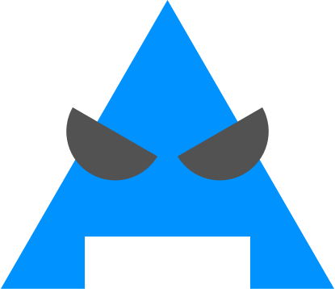
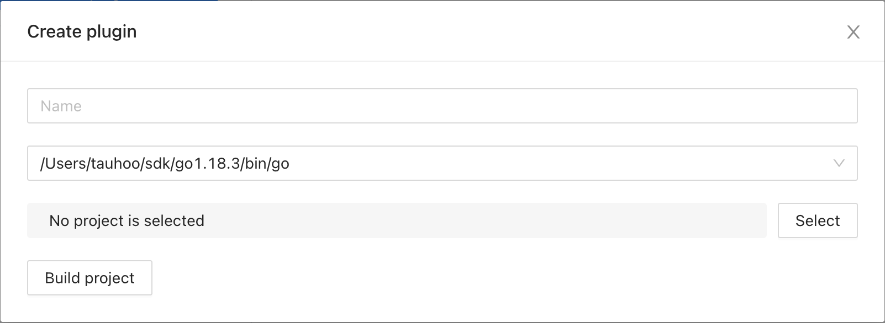
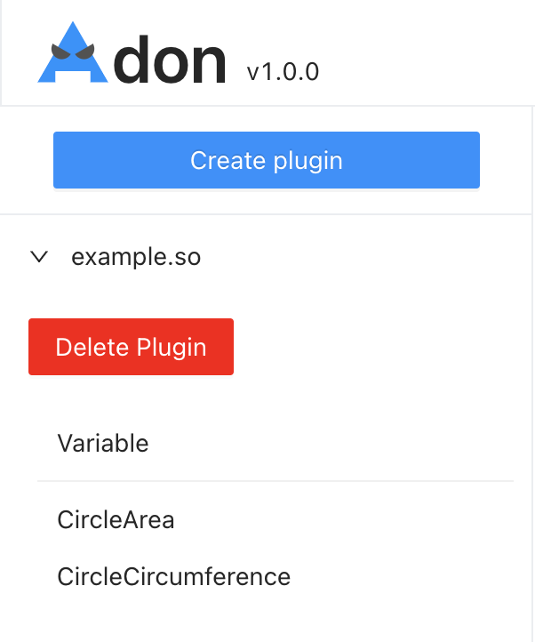

# Adon
Adon is basic Go plugin interpretor. It convert Go plugin to GUI.

# Installation
## Go binary
To compile plugin, you need to install Go version `1.18.3` first. Because, Adon use `go` or `go1.18.3` command to compile plugins.
## Adon
To build this project you need 3 things.
- [go1.18.3](https://go.dev/dl/)
- [astilectron-bundler](https://github.com/asticode/go-astilectron-bundler)
- [NodeJS](https://nodejs.org/en/)

Remove architecture that you don't want to be build in `bundler.json`

```json
{
  "app_name": "Adon",
  "icon_path_darwin": "resources/logo.icns",
  "icon_path_linux": "resources/logo.png",
  "icon_path_windows": "resources/logo.ico",
  "version_electron": "19.0.0",
  "version_astilectron": "0.55.0",
  "go_binary_path": "go1.18.3",
  "resources_path": "resources",
  "working_directory_path": "temp",
  "output_path": "out/app",
  "environments": [
    {
      "os": "darwin",
      "arch": "amd64"
    },
	// you can remove environment below if you don't want it.
    // {
    //   "os": "darwin",
    //   "arch": "arm64"
    // },
    // {
    //   "os": "linux",
    //   "arch": "amd64"
    // },
    // {
    //   "os": "linux",
    //   "arch": "arm"
    // },
    // {
    //   "os": "linux",
    //   "arch": "arm64"
    // }
  ]
}
```

Then, run this command at the root directory.

```
make all
```

Wait until it finish. The results is in folder
```
out/app/{os and architect}/Adon.app
```
or
```
out/app/{os and architect}/Adon
```

# Plugin
To create a plugin, you can just init basic go project with go mod init.
```bash
mkdir plugin-folder
cd plugin-folder
go mod init example.com/m
touch main.go
```

### main.go
```go
package main

var PI float32 = 3.14

func CircleArea(radius float32) float32 {
	return PI*radius*radius
}

func CircleCircumference(radius float32) float32 {
	return 2*PI*radius
}
```

### go.mod
```
module example.com/m

go 1.18
```

Then open Adon and create a plugin with Create Plugin button. 


Fill plugin name, plugin project path and click build



New plugin show at the left


